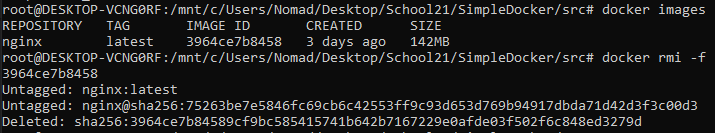

## Part 1. Готовый докер
* скачиваем официальный докер образ с nginx при помощи команды `docker pull nginx`

* Проверить наличие докер образа через `docker images`

* Запустить докер образ через `docker run -d [image_id|repository]`

* Проверить, что образ запустился через `docker ps`

* Посмотреть информацию о контейнере через `docker inspect [container_id|container_name]`

* По выводу команды определить и поместить в отчёт размер контейнера, список замапленных портов и ip контейнера

* Остановить докер образ через `docker stop [container_id|container_name]`

* Проверить, что образ остановился через `docker ps`

* Запустить докер с замапленными портами 80 и 443 на локальную машину через команду `run`

* Проверить, что в браузере по адресу *localhost:80* доступна стартовая страница **nginx**

* Перезапустить докер контейнер через `docker restart [container_id|container_name]`
* Проверить любым способом, что контейнер запустился

## Part 2. Операции с контейнером 

* Прочитать конфигурационный файл *nginx.conf* внутри докер контейнера через команду *exec*

* Создать на локальной машине файл *nginx.conf*
* Настроить в нем по пути */status* отдачу страницы статуса сервера **nginx**  

* Скопировать созданный файл *nginx.conf* внутрь докер образа через команду `docker cp`
* Перезапустить **nginx** внутри докер образа через команду *exec*

* Проверить, что по адресу *localhost:80/status* отдается страничка со статусом сервера **nginx**

* Экспортировать контейнер в файл *container.tar* через команду *export*

* Остановить контейнер

* Удалить образ через `docker rmi [image_id|repository]`, не удаляя перед этим контейнеры

* Удалить остановленный контейнер

* Импортировать контейнер обратно через команду *import*

* Запустить импортированный контейнер

* Проверить, что по адресу *localhost:80/status* отдается страничка со статусом сервера **nginx**
